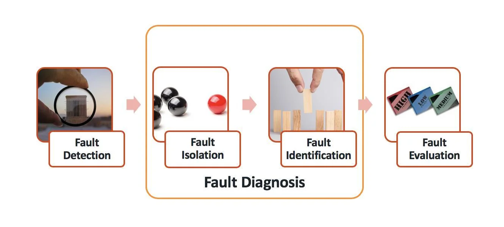
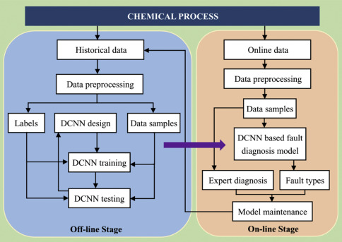
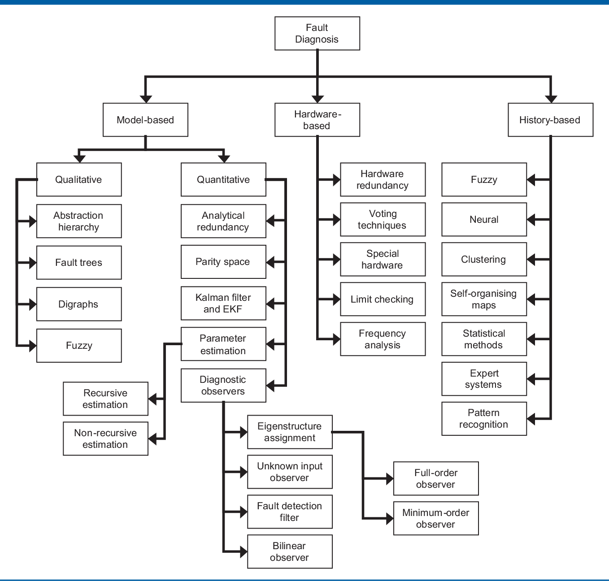
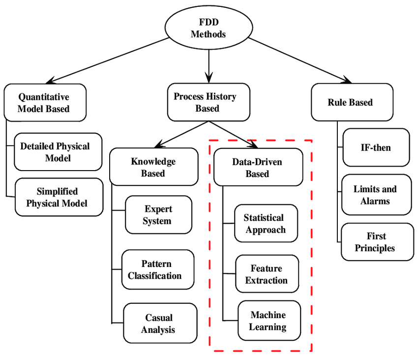
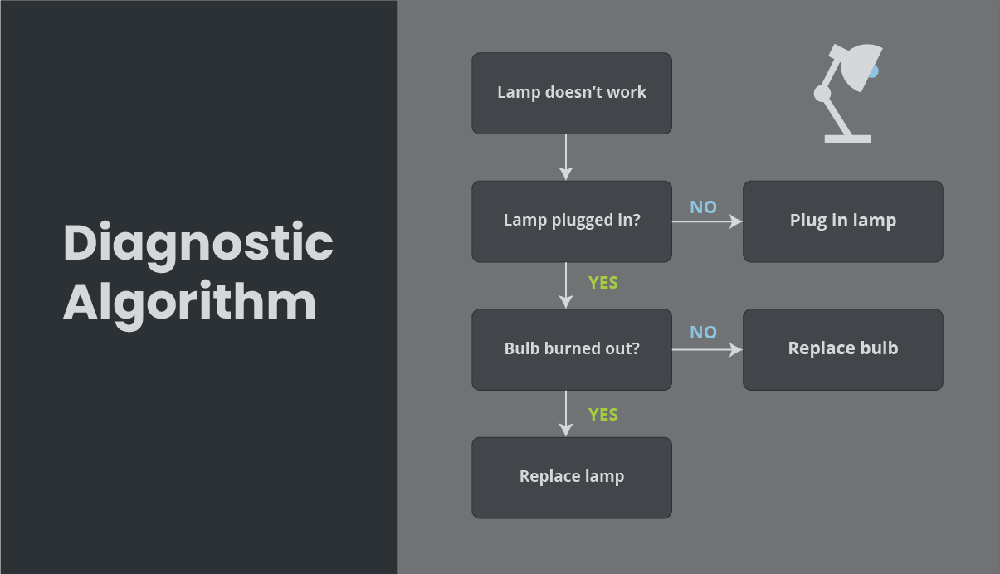

Fault detection and diagnosis (FDD) is a crucial aspect of control systems in industrial plants, factories, and other real-world applications. It involves identifying and isolating faults or abnormal conditions in a system to maintain optimal performance, prevent equipment failures, and minimize downtime. Here's a detailed explanation of the steps involved in fault detection and diagnosis in control systems:

## Steps in Fault Detection and Diagnosis

1. **Data Collection**: The first step is to collect data from various sensors and monitoring systems installed throughout the plant or factory. This data includes parameters such as temperature, pressure, flow rates, vibration levels, and energy consumption

2. **Data Analysis**: The collected data is then analyzed using advanced algorithms and software tools. This analysis involves comparing the data to predefined patterns, models, and thresholds to identify deviations from normal operating conditions

3. **Fault Detection**: Based on the data analysis, potential faults or abnormalities are identified. This stage focuses on recognizing that a problem has occurred, even if the root cause is not yet known

4. **Fault Isolation**: Once a fault is detected, the next step is to isolate the faulty component or subsystem. This involves narrowing down the potential causes by analyzing the data and the relationships between different variables

5. **Fault Identification**: After isolating the faulty component, the root cause of the fault is determined. This requires a thorough analysis of the component's behavior, performance characteristics, and any relevant environmental factors

6. **Corrective Action**: Based on the fault diagnosis, appropriate corrective actions are taken to rectify the problem. This may involve adjusting system settings, replacing faulty components, or implementing maintenance procedures

## Types of Fault Detection and Diagnosis Techniques

1. **Model-based techniques**: These methods rely on mathematical models of the system to detect and diagnose faults. They compare the actual system behavior with the expected behavior predicted by the model

2. **Knowledge-based techniques**: These techniques utilize expert knowledge, rules, and heuristics to detect and diagnose faults. They often involve the use of fuzzy logic, neural networks, and expert systems[2][5].

3. **Data-driven techniques**: Data-driven methods utilize machine learning algorithms to analyze historical data and identify patterns and relationships that can be used for fault detection and diagnosis

## Benefits of Fault Detection and Diagnosis

1. **Improved reliability**: By detecting and diagnosing faults early, control systems can prevent equipment failures and maintain favorable operating conditions

2. **Reduced downtime**: Prompt identification and resolution of faults minimize the time required for repairs and maintenance, reducing overall downtime

3. **Enhanced safety**: Fault detection and diagnosis help identify potential safety hazards and take appropriate measures to mitigate risks

4. **Increased efficiency**: By optimizing system performance and minimizing energy consumption, fault detection and diagnosis contribute to overall efficiency improvements

5. **Cost savings**: Proactive maintenance and reduced downtime lead to significant cost savings in terms of repair expenses, lost production, and energy consumption

Fault detection and diagnosis are essential components of modern control systems in industrial plants, factories, and other real-world applications. By implementing advanced FDD techniques, control systems can maintain optimal performance, prevent equipment failures, and ensure safe and efficient operations.