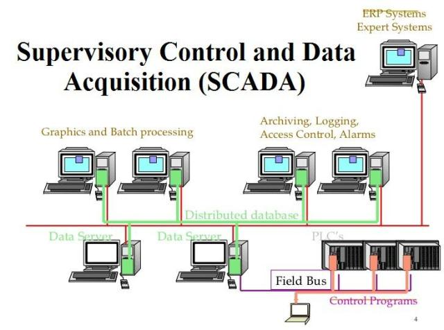

Supervisory Control and Data Acquisition (SCADA) is a computer-based system that is designed to monitor and control industrial processes in real-time. SCADA systems are widely used in various industries, including manufacturing, water/wastewater management, oil and gas, power generation and distribution, and transportation.

The key steps involved in a SCADA system in the real world are:

1. Data Collection:
   - SCADA systems utilize various field devices such as sensors, meters, and Remote Terminal Units (RTUs) to gather data from the industrial processes and equipment.
   - These field devices collect real-time data on parameters like temperature, pressure, flow rates, equipment status, and other relevant process variables.

2. Data Transmission:
   - The data collected by the field devices is transmitted to a central control center or server using communication networks, such as wired or wireless protocols (e.g., Modbus, Ethernet, cellular).
   - The communication network allows the SCADA system to monitor and control the processes from a centralized location.

3. Data Processing and Analysis:
   - The SCADA system's software, known as the Human-Machine Interface (HMI), receives the data from the field devices and processes it.
   - The HMI software displays the data in a user-friendly format, allowing operators to monitor the process status and trends.
   - Advanced SCADA systems also incorporate data analysis algorithms to detect anomalies, optimize processes, and generate reports.

4. Supervisory Control:
   - The SCADA system not only monitors the processes but also allows operators to remotely control and adjust the industrial equipment.
   - Operators can use the HMI to send control commands to field devices, such as opening or closing valves, starting or stopping motors, and adjusting setpoints.

5. Alarm Management:
   - SCADA systems are equipped with alarm management capabilities to notify operators of any critical events or abnormal conditions in the industrial processes.
   - Alarms can be triggered based on predefined thresholds or rules, and the system can be configured to send alerts via various channels, such as email, SMS, or audible alarms.

Types of SCADA Systems:

1. Monolithic SCADA Systems:
   - These are the earliest SCADA systems, which were based on mainframe computers and proprietary software.
   - Monolithic SCADA systems were self-contained and did not have the ability to communicate with other systems.

2. Distributed SCADA Systems:
   - Distributed SCADA systems emerged with the advent of smaller computer systems and Local Area Network (LAN) technology.
   - These systems allowed for interconnectivity between different SCADA components, but the communication protocols were often proprietary.

3. Modern SCADA Systems:
   - Modern SCADA systems leverage advancements in computer technology, networking, and open communication protocols.
   - They offer enhanced data acquisition, real-time monitoring, advanced analytics, and integration with other enterprise systems.
   - Wireless SCADA systems are also becoming more prevalent, leveraging wireless communication technologies to reduce installation costs and improve flexibility.

SCADA systems play a crucial role in industrial control systems by enhancing operational efficiency, improving process optimization, and ensuring safety and compliance. The evolution of SCADA technology has enabled industries to achieve higher levels of automation, data-driven decision-making, and remote monitoring and control capabilities.

References:

[1] https://ieeexplore.ieee.org/document/1458199

[2] https://www.sangfor.com/glossary/cloud-and-infrastructure/what-is-supervisory-control-and-data-acquisition

[3] https://www.accuenergy.com/application-solutions/scada-supervisory-control-data-acquisition/

[4] https://oleumtech.com/what-is-scada

[5] https://inductiveautomation.com/resources/article/what-is-scada