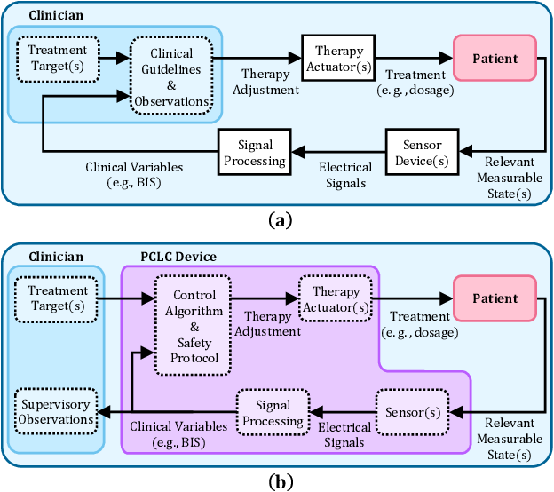

Programmable Logic Controllers (PLCs) are widely used in industrial control systems to automate various processes in factories, plants, and other real-world applications. Here's a detailed explanation of PLCs, the steps involved in a PLC-based control system, and the different types of PLCs:

## Programmable Logic Controllers (PLCs)

A PLC is a digital computer used for automation of industrial processes, such as control of machinery on factory assembly lines. PLCs are designed to be rugged and reliable, capable of operating in harsh environments and withstanding vibrations, temperature extremes, and other challenging conditions

## Steps in a PLC-based Control System

1. **Sensor Data Collection**: Sensors are used to gather information about the process being controlled, such as temperature, pressure, flow rate, or the position of a mechanical device

2. **Signal Conditioning**: The sensor signals are conditioned, which may involve amplification, filtering, or analog-to-digital conversion, to ensure that the PLC can properly interpret the data.

3. **PLC Programming**: The PLC is programmed using ladder logic or other programming languages to define the control logic and sequence of operations based on the sensor inputs and desired outputs

4. **Output Control**: Based on the sensor inputs and the programmed control logic, the PLC generates output signals to control various devices, such as motors, valves, or lights, to maintain the desired process conditions

5. **Human-Machine Interface (HMI)**: An HMI, such as a touchscreen display, allows operators to monitor the process, adjust setpoints, and troubleshoot issues

6. **Data Logging and Communication**: PLCs can log process data for historical analysis and communicate with other systems, such as SCADA (Supervisory Control and Data Acquisition) systems, to provide remote monitoring and control capabilities

## Types of PLCs

1. **Compact PLCs**: These are small, self-contained PLCs suitable for simple control applications with a limited number of inputs and outputs

2. **Modular PLCs**: Modular PLCs consist of a central processing unit (CPU) and various input/output (I/O) modules that can be connected to the CPU as needed. This allows for more flexibility and scalability in the control system design

3. **Rack-mounted PLCs**: These PLCs are designed to be mounted in a rack and are typically used in larger, more complex control systems. They offer more processing power and I/O capabilities compared to compact and modular PLCs

4. **Distributed Control Systems (DCS)**: In a DCS, control is distributed among multiple controllers, each responsible for a specific part of the process. This approach offers improved reliability, flexibility, and scalability compared to centralized control systems

5. **Soft PLCs**: Soft PLCs are software-based PLCs that run on standard computer hardware or industrial PCs. They offer the flexibility of software-based control without the need for dedicated PLC hardware

PLCs are essential components of modern industrial control systems, providing reliable, flexible, and scalable automation solutions for a wide range of applications, from simple machinery control to complex process automation in factories, plants, and other real-world settings.

References:
[1] https://www.ncbi.nlm.nih.gov/pmc/articles/PMC6233305/

[2] https://ieeexplore.ieee.org/abstract/document/8964302/

[3] https://dspace.mit.edu/handle/1721.1/122131

[4] https://arxiv.org/pdf/1910.03768.pdf

[5] https://www.fda.gov/media/154994/download