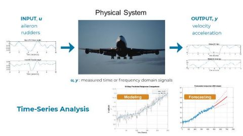

System identification is the process of creating a mathematical model of a system from its external observations (inputs and outputs). It is a crucial aspect of control systems engineering, as it allows for the derivation of dynamic models from experimental data.

The main steps involved in system identification for industrial control systems are:

1. **Data Collection**: Sensors are used to gather information about the process being controlled, such as temperature, pressure, flow rate, or the position of a mechanical device

2. **Signal Conditioning**: The sensor signals are conditioned, which may involve amplification, filtering, or analog-to-digital conversion, to ensure that the system can properly interpret the data

3. **Experiment Design**: A suitable input signal is designed, and an experiment is conducted to measure the system response

4. **Model Structure Selection**: The model structure is chosen based on the available knowledge about the system. This can be done using a black-box approach, where the input-output relationship is estimated from experimental data only, or a gray-box approach, which combines first principles with experimental data

5. **Parameter Estimation**: The collected data is used to estimate the parameters of the chosen model structure using numerical techniques

6. **Model Validation**: The identified model is validated by comparing its predictions with new experimental data or by checking if it satisfies certain properties, such as stability and performance

Types of System Identification Methods:

1. **Parametric Methods**: These methods assume a specific model structure, such as a transfer function or a state-space model, and estimate the parameters of the model from the data.

2. **Non-parametric Methods**: These methods do not assume a specific model structure but rather estimate the frequency response or the impulse response of the system from the data

3. **Time-domain Methods**: These methods use time-domain data, such as step responses or impulse responses, to identify the model

4. **Frequency-domain Methods**: These methods use frequency-domain data, such as Bode plots or Nyquist plots, to identify the model

5. **Subspace Methods**: These methods use linear system theory and optimization techniques to directly obtain state-space models from either time- or frequency-domain data

System identification is widely used in various industrial applications, such as process control, robotics, aerospace, and power systems, to derive dynamic models for control design, optimization, and analysis purposes

References:

[1] https://link.springer.com/chapter/10.1007/978-3-031-08270-2_2

[2] https://www.youtube.com/watch?v=YiJRgKJ0My8

[3] https://control.ee.ethz.ch/research/theory/system-identification.html

[4] https://ieeecss.org/tc/system-identification-adaptive-control

[5] https://www.youtube.com/watch?v=Z1QS6FsxrJI