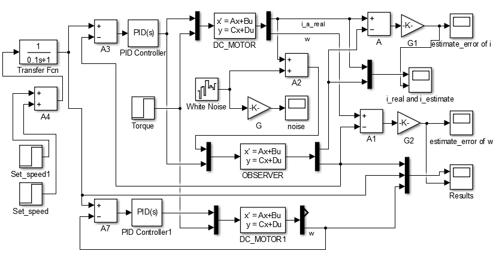
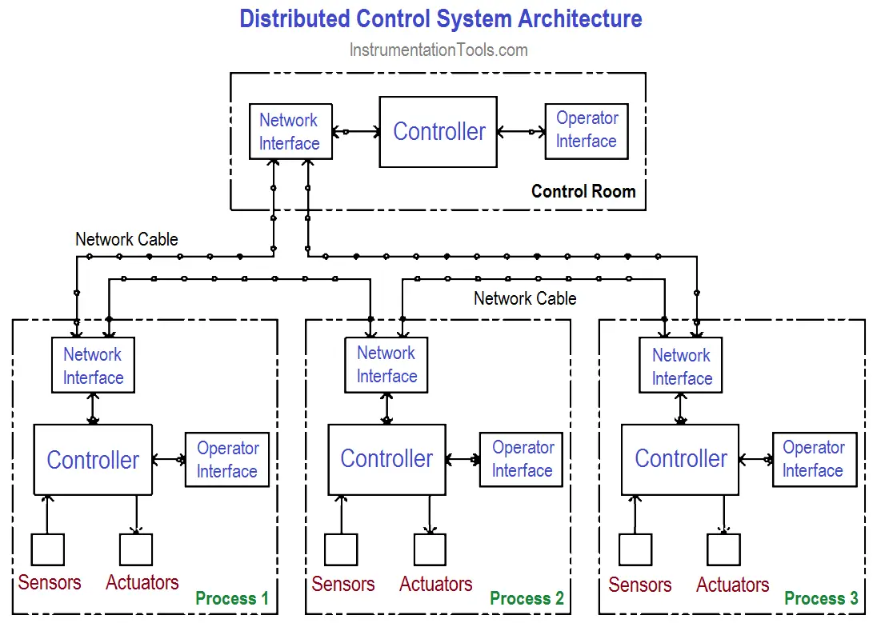

## Control System Simulation in Control Systems

Control system simulation involves using software tools to model, analyze, and test control systems before implementation in real-world applications. Simulation allows engineers to evaluate the performance, stability, and robustness of control systems under various operating conditions without the need for physical prototypes.

## Steps in a Real-World Control System Simulation

1. **Modeling**: The first step in control system simulation is to create a mathematical model of the system being controlled. This model captures the dynamics, interactions, and behavior of the system components.

2. **Controller Design**: Based on the system model, control algorithms are designed to achieve desired performance objectives, such as stability, speed of response, and disturbance rejection.

3. **Simulation Setup**: The system model and control algorithms are implemented in simulation software, such as MATLAB/Simulink, to create a virtual representation of the control system.

4. **Scenario Testing**: Different scenarios and operating conditions are simulated to evaluate the system's response under normal operation, disturbances, parameter variations, and fault conditions.

5. **Performance Analysis**: Performance metrics, such as rise time, overshoot, settling time, and stability margins, are analyzed to assess the effectiveness of the control system design.

6. **Optimization**: Control parameters are fine-tuned to optimize the system's performance based on simulation results and performance criteria.

## Types of Control System Simulation

1. **Linear Time-Invariant (LTI) Simulation**: This type of simulation assumes that the system dynamics are linear and time-invariant, making it suitable for systems with stable and predictable behavior.

2. **Nonlinear Simulation**: Nonlinear simulation accounts for system nonlinearities, such as saturation, dead zones, and hysteresis, to model more complex and realistic system behavior.

3. **Hardware-in-the-Loop (HIL) Simulation**: HIL simulation involves integrating physical hardware components, such as sensors and actuators, with the simulation software to test control algorithms in real-time.

4. **Real-Time Simulation**: Real-time simulation runs control algorithms on dedicated hardware platforms to mimic the timing constraints and computational performance of embedded control systems.

5. **Co-Simulation**: Co-simulation involves integrating multiple simulation tools to model different aspects of the control system, such as plant dynamics, controller design, and communication networks.

References:

[1] https://www.controleng.com/control-systems/

[2] https://www.electronicsforu.com/technology-trends/learn-electronics/control-system-definition-types-applications-and-faqs

[3] https://www.techtarget.com/whatis/definition/control-system

[4] https://www.mathworks.com/solutions/control-systems.html

[5] https://www.youtube.com/watch?v=YiJRgKJ0My8