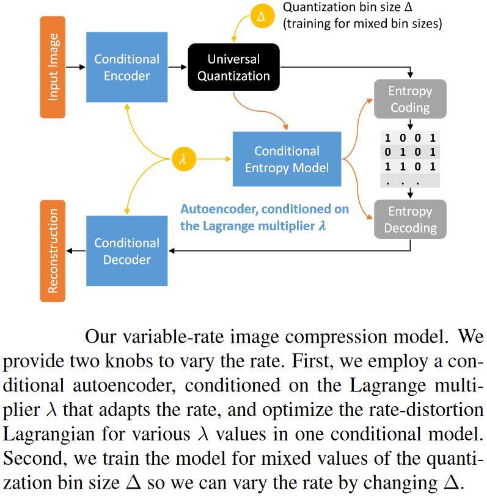
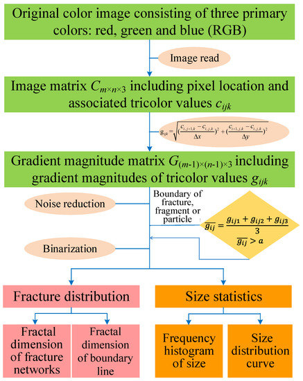
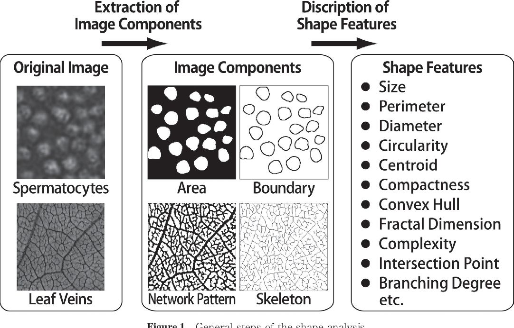
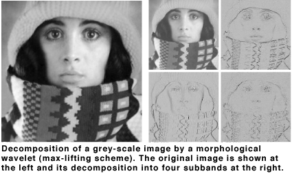

Image processing is a powerful tool that uses mathematical operations to manipulate and analyze digital images. It involves a wide range of techniques that can be applied to various real-world problems. Here are some key image processing techniques, their mathematical foundations, and use cases with examples:

## Image Enhancement

Image enhancement techniques aim to improve the visual quality of an image by modifying its contrast, brightness, or sharpness. These techniques often involve mathematical operations such as histogram equalization, contrast stretching, and filtering.

Example: Enhancing the contrast of a low-contrast medical image to improve the visibility of anatomical structures

## Image Restoration

Image restoration techniques are used to remove noise, blur, or other artifacts from an image to restore its original quality. These techniques often involve mathematical operations such as deconvolution, filtering, and regularization.

Example: Removing motion blur from a surveillance camera image to identify a suspect

## Image Segmentation

Image segmentation is the process of partitioning an image into multiple segments or regions based on similar properties such as color, texture, or shape. Segmentation techniques often involve mathematical operations such as thresholding, edge detection, and clustering.

Example: Segmenting a brain MRI image to identify different tissue types (gray matter, white matter, and cerebrospinal fluid)

## Object Recognition and Detection

Object recognition and detection techniques are used to locate and identify objects in an image. These techniques often involve mathematical operations such as feature extraction, template matching, and machine learning algorithms like convolutional neural networks.

Example: Detecting and classifying vehicles in a traffic surveillance image to monitor traffic flow

## Image Filtering

Image filtering techniques are used to enhance, blur, or sharpen images. These techniques often involve mathematical operations such as convolution with a filter kernel or mask.

Example: Applying a Gaussian filter to an image to reduce noise while preserving edges[2][4].

## Fourier Transform

The Fourier transform is a mathematical technique used to convert an image from the spatial domain to the frequency domain. It allows for frequency-based analysis and processing of images.

Example: Using the Fourier transform for image compression by removing high-frequency components.

## Wavelet Transform

The wavelet transform is a mathematical technique used to decompose an image into multiple scales and orientations. It allows for multi-resolution analysis and processing of images.

Example: Using the wavelet transform for image denoising by removing high-frequency noise components

References:

[1] https://www.scaler.com/topics/mathematical-operations-on-images-in-computer-vision/

[2] http://www.cse.iitm.ac.in/~vplab/courses/optimization/MAths_IM_DEBLUR_ENH_SD_EDT_2016.pdf

[3] https://people.math.wisc.edu/~angenent/preprints/medicalBAMS.pdf

[4] https://en.wikipedia.org/wiki/Digital_image_processing

[5] https://www.v7labs.com/blog/image-processing-guide