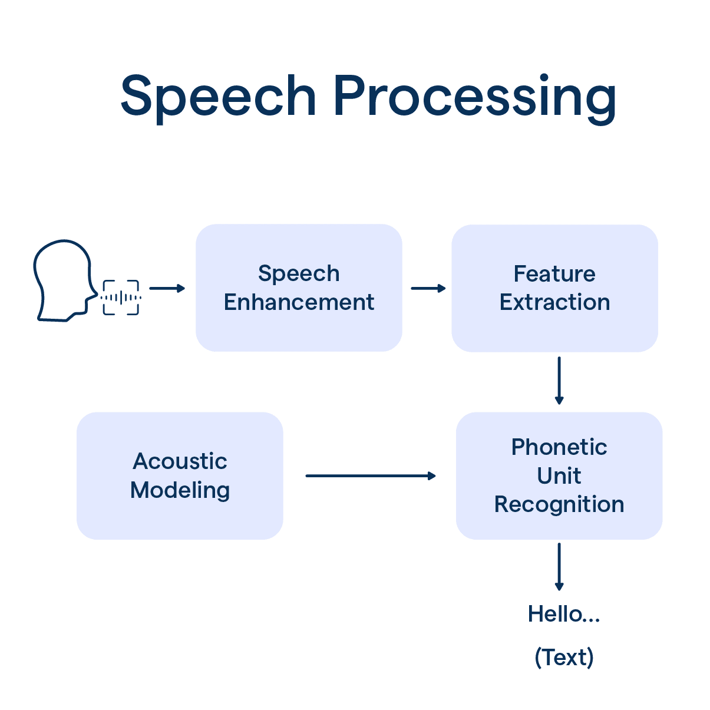
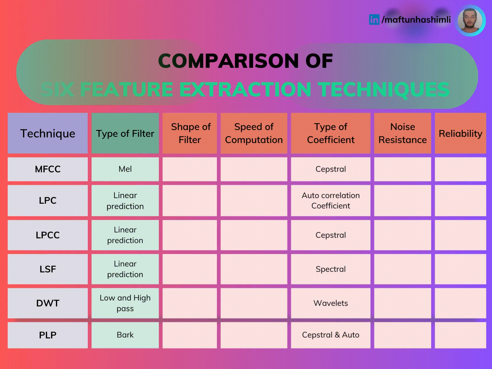
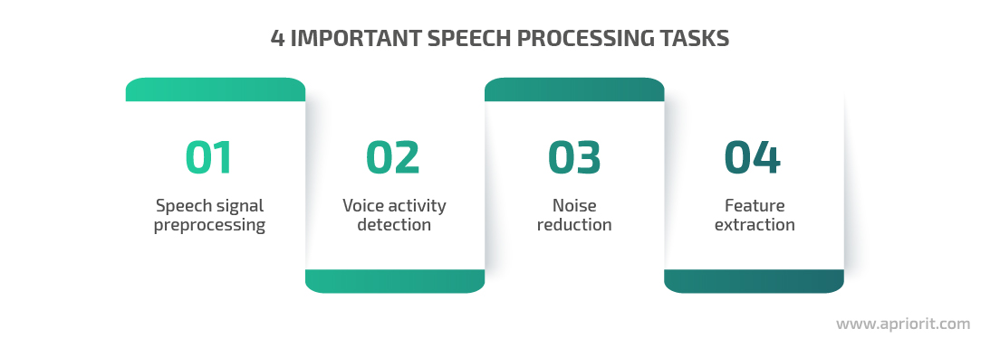
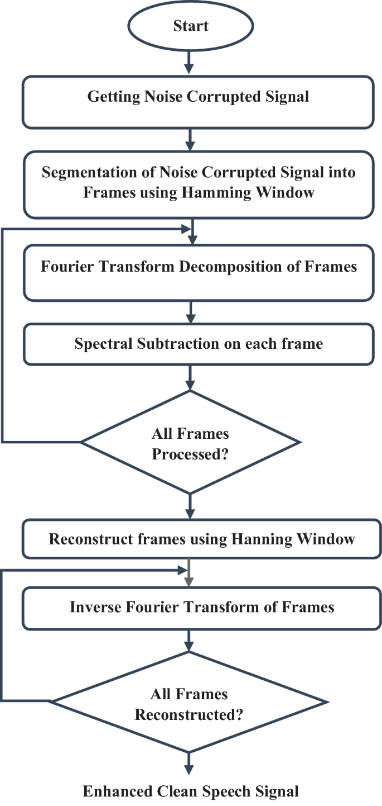

Speech processing is a field that applies various techniques to analyze, manipulate, and synthesize human speech. It involves the application of mathematical principles and algorithms to address different aspects of speech, such as recognition, synthesis, and enhancement. Here are some key speech processing techniques, their mathematical foundations, and use cases with examples:

## Speech Recognition

Speech recognition is the process of converting spoken language into text. It involves techniques such as acoustic modeling, language modeling, and decoding. Acoustic modeling uses statistical methods like Gaussian mixture models or neural networks to map acoustic features to phonemes. Language modeling uses techniques like n-gram models or recurrent neural networks to predict the likelihood of word sequences

Example: Transcribing a lecture or meeting using speech recognition to generate text captions or subtitles

## Speech Synthesis

Speech synthesis, also known as text-to-speech (TTS), is the process of generating artificial speech from text. It involves techniques such as text analysis, prosody modeling, and waveform generation. Text analysis uses natural language processing to determine the pronunciation and intonation of words. Prosody modeling uses mathematical models to generate the rhythm, stress, and intonation of speech. Waveform generation uses techniques like concatenative synthesis or statistical parametric synthesis to generate the actual speech waveform

Example: Generating synthetic speech for assistive technologies, such as screen readers for the visually impaired or voice interfaces for smart devices

## Speaker Recognition

Speaker recognition is the process of identifying or verifying a person's identity based on their voice characteristics. It involves techniques such as feature extraction, modeling, and classification. Feature extraction uses signal processing methods to extract acoustic features like pitch, formants, and cepstral coefficients. Modeling uses techniques like Gaussian mixture models or i-vectors to represent a speaker's voice characteristics. Classification uses machine learning algorithms to compare input speech to stored models and make a decision about the speaker's identity[

Example: Authenticating a user's identity for secure access to a system or service using their voice as a biometric

## Speech Enhancement

Speech enhancement is the process of improving the quality and intelligibility of speech by reducing noise, echo, or other distortions. It involves techniques such as spectral subtraction, Wiener filtering, and beamforming. Spectral subtraction uses the short-time Fourier transform to estimate and remove noise components from the speech spectrum. Wiener filtering uses a statistical approach to estimate the clean speech signal from the noisy input. Beamforming uses an array of microphones and spatial filtering to enhance speech from a specific direction while suppressing noise and interference from other directions

Example: Improving the quality of speech in a noisy environment, such as a car or a crowded room, for better communication or voice-based applications

The key mathematical techniques used in speech processing include:

## Digital Signal Processing (DSP)

DSP techniques are fundamental to speech processing, involving operations like filtering, spectral analysis, and waveform generation. DSP relies on concepts from linear algebra, difference equations, and the Fourier transform.

## Statistical Modeling

Statistical models are widely used in speech recognition and synthesis. Techniques like Gaussian mixture models, hidden Markov models, and neural networks are used for acoustic and language modeling. These models draw from probability theory, information theory, and machine learning.

## Pattern Recognition

Pattern recognition is crucial for tasks like speech recognition and speaker identification. Techniques like dynamic time warping, vector quantization, and support vector machines are used for pattern matching and classification. These methods utilize concepts from signal processing, optimization, and machine learning

## Optimization

Optimization techniques are used to train statistical models and find optimal parameters. Algorithms like expectation-maximization, gradient descent, and Viterbi decoding are used for model training and inference. These techniques rely on concepts from calculus, linear algebra, and algorithm design.

## Psychoacoustics

Psychoacoustic principles are used in speech enhancement and coding to model human auditory perception. Techniques like critical band analysis, equal-loudness curves, and masking models draw from acoustics, physiology, and psychology

## Information Theory

Information theory provides a framework for analyzing and quantifying speech signals. Concepts like entropy, mutual information, and rate-distortion theory are used in speech coding and recognition. These techniques rely on probability theory and information theory

These mathematical techniques, along with others from fields like linguistics and computer science, form the foundation of modern speech processing systems. By combining these tools, researchers and engineers can develop advanced applications for speech recognition, synthesis, enhancement, and beyond.

References:

[1] https://researchers.mq.edu.au/en/publications/mathematical-foundations-of-speech-and-language-processing

[2] https://www.jstor.org/stable/20461520

[3] https://www.amazon.in/Mathematical-Foundations-Processing-Mathematics-Applications/dp/0387203265

[4] https://books.google.com/books/about/Mathematical_Foundations_of_Speech_and_L.html?id=Zhp3DA0Ric8C

[5] https://www.marketfairshoppes.com/shopnow/product/mathematical-foundations-of-speech-and-language-processing-edition-1-barnesnoble-a62755

[6] https://www.jstor.org/stable/20461520

[7] https://www.amazon.in/Mathematical-Foundations-Processing-Mathematics-Applications/dp/0387203265