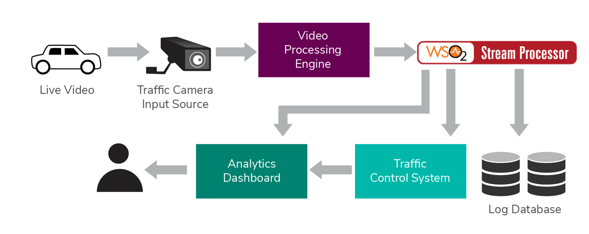
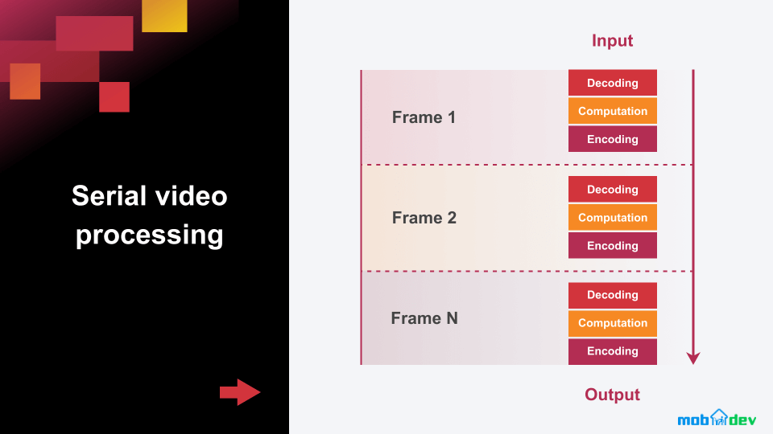

Video processing involves applying various techniques to analyze, manipulate, and extract meaningful information from video data. It builds upon the principles of image processing, but also incorporates temporal information from the sequence of frames. 

## Object Tracking

Object tracking is the process of locating a moving object over time using a camera. It involves techniques like Kalman filtering, mean-shift, and correlation filters. These methods use mathematical models to predict the object's location in subsequent frames based on its motion and appearance.

Example: Tracking vehicles in a traffic surveillance video to monitor traffic flow and detect accidents.

## Motion Estimation

Motion estimation is the process of determining the motion vectors that describe the transformation from one image to another. It involves techniques like block matching, optical flow, and phase correlation. These methods use mathematical optimization to find the best match between blocks or pixels in consecutive frames.

Example: Estimating the motion of a camera mounted on a vehicle to stabilize the video and remove unwanted shaking

## Video Segmentation

Video segmentation is the process of partitioning a video into meaningful regions or objects. It involves techniques like background subtraction, change detection, and spatio-temporal clustering. These methods use mathematical models to separate the foreground objects from the background or group pixels with similar motion patterns.

Example: Segmenting a video of a soccer game to track the players and the ball and analyze their movements.

## Video Compression

Video compression is the process of reducing the size of video data while preserving its quality. It involves techniques like transform coding, motion-compensated prediction, and entropy coding. These methods use mathematical transforms, quantization, and coding to remove spatial and temporal redundancies in the video.

Example: Compressing a high-definition video for efficient storage or transmission over the internet.

## Video Enhancement

Video enhancement is the process of improving the visual quality of a video by reducing noise, sharpening edges, or adjusting contrast. It involves techniques like temporal filtering, super-resolution, and color correction. These methods use mathematical filters, interpolation, and color models to enhance the video's appearance.

Example: Enhancing the quality of a low-resolution video captured by a surveillance camera to improve the visibility of details.

References:
[1] https://www.mathworks.com/solutions/image-video-processing/video-processing.html

[2] https://wso2.com/whitepapers/innovating-with-video-analytics-technologies-and-use-cases/

[3] https://www.researchgate.net/publication/228612963_A_Review_on_Image_Video_Processing

[4] https://mrcet.com/downloads/digital_notes/ECE/IV%20Year/10082021/IMAGE%20AND%20VIDEO%20PROCESSING.pdf

[5] https://www.geeksforgeeks.org/real-life-application-of-maths-in-technology/