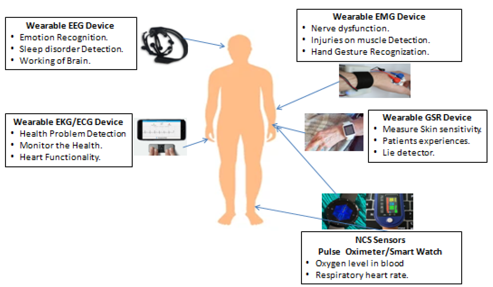
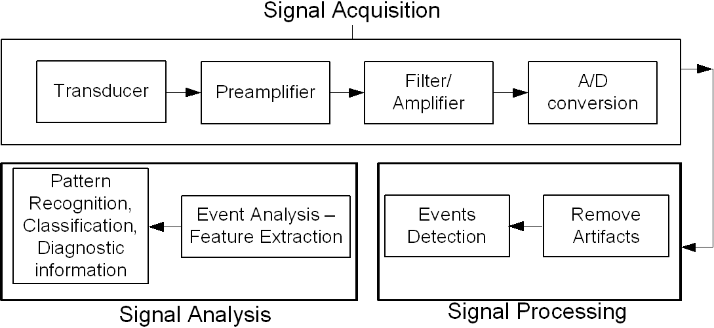

Biomedical signal processing is a field that applies various techniques to analyze, enhance, and interpret signals from living organisms for medical purposes. It involves the application of mathematical and computational methods to extract meaningful information from biomedical signals like electrocardiograms (ECG), electroencephalograms (EEG), and electromyograms (EMG). Here are some key biomedical signal processing techniques, their mathematical foundations, and use cases with examples:

## Noise Reduction

Noise reduction techniques aim to remove or minimize the noise components from biomedical signals while preserving the relevant information. Some common techniques are:

- Filtering: Applies a frequency-based criterion to eliminate unwanted components using mathematical filters like Butterworth or Chebyshev filters.
- Wavelet denoising: Decomposes the signal into different scales using wavelet transforms and thresholds the noise coefficients based on statistical models.
- Adaptive filtering: Adjusts the filter parameters according to the signal characteristics and noise statistics using algorithms like least mean squares (LMS) or recursive least squares (RLS).

Example: Reducing motion artifacts and power line interference from an ECG signal to improve the diagnosis of heart conditions.

## Feature Extraction

Feature extraction techniques transform biomedical signals into a lower-dimensional and more informative space to facilitate analysis and classification. Some common techniques are:

- Fourier transform: Converts the signal from time domain to frequency domain and reveals its spectral components using mathematical transforms like discrete Fourier transform (DFT) or fast Fourier transform (FFT).
- Principal component analysis (PCA): Reduces the dimensionality of the signal by finding the orthogonal directions of maximum variance using linear algebra and statistical methods.
- Wavelet transform: Decomposes the signal into different frequency bands and captures its local and global characteristics using wavelet basis functions and multiresolution analysis.

Example: Extracting features like QRS complex, ST segment, and T wave from an ECG signal to diagnose myocardial infarction or arrhythmia

## Signal Segmentation

Signal segmentation techniques divide biomedical signals into segments or intervals that correspond to different events, phases, or states. Some common techniques are

- Thresholding: Applies a predefined or adaptive criterion to separate the segments based on amplitude or slope using mathematical inequalities.
- Peak detection: Finds the local maxima or minima of the signal and defines the segments around them using mathematical optimization and signal processing algorithms.
- Hidden Markov models (HMM): Model the signal as a sequence of discrete states and estimate their transition probabilities using statistical inference and machine learning.

Example: Segmenting an EEG signal into different sleep stages or epileptic seizure events to diagnose sleep disorders or epilepsy

## Signal Classification

Signal classification techniques assign biomedical signals or their segments to predefined classes or groups based on their features. Some common techniques are

- Linear discriminant analysis (LDA): Finds a linear boundary that separates the classes using matrix algebra and statistical methods.
- Support vector machines (SVM): Find a nonlinear boundary that maximizes the margin between the classes using optimization and kernel methods.
- Artificial neural networks (ANN): Learn a complex function that maps the input features to the output classes using machine learning algorithms and numerical optimization.

Example: Classifying an EMG signal into different muscle activation patterns to control a prosthetic limb or diagnose neuromuscular disorders

References:

[1] https://www.linkedin.com/advice/0/what-most-common-signal-enhancement-techniques-biomedical-fmngf

[2] https://www.electronicsforu.com/technology-trends/learn-electronics/signal-processing

[3] https://www.slideshare.net/meenusood9/biomedical-signal-processing-239121756

[4] https://www.longdom.org/open-access/biomedical-signal-and-its-processing-techniques-99446.html

[5] https://www.researchgate.net/publication/352206379_Use_of_Transforms_in_Biomedical_Signal_Processing_and_Analysis