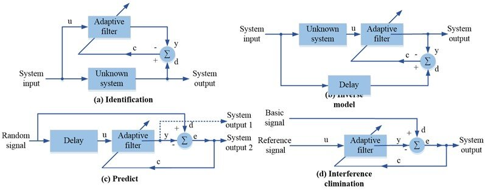
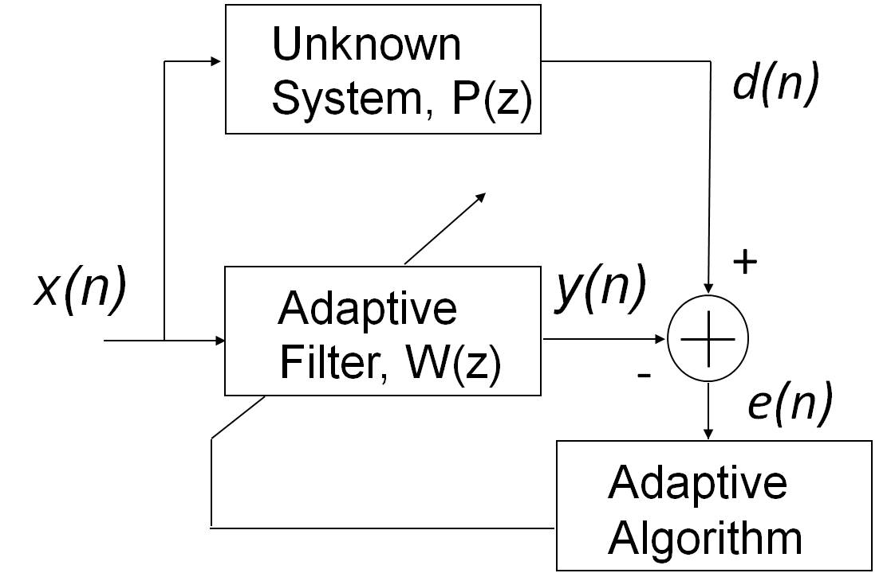
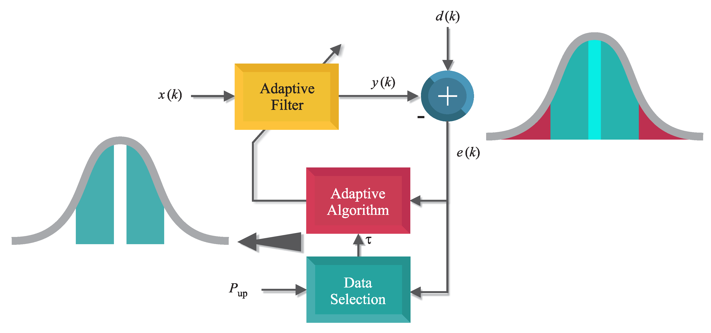

## Adaptive Filtering

Adaptive filtering is a powerful technique used to adjust the parameters of a digital filter in real-time to optimize its performance based on an optimization criterion. The filter's transfer function is controlled by variable parameters that are updated according to an adaptive algorithm

The main components of an adaptive filter are:

1. A digital filter structure (e.g., FIR or IIR)
2. An adaptive algorithm that updates the filter coefficients
3. A cost function that defines the optimization criterion

The adaptive algorithm adjusts the filter coefficients to minimize the cost function, which is typically the mean squared error between the filter output and a desired response.

## Types of Adaptive Filters

There are three main types of adaptive filters based on their configuration:

1. **Prediction**: The adaptive filter predicts the current input signal using a delayed version of the input. The desired signal is the input itself. Applications include signal encoding and noise reduction.

2. **System Identification**: The adaptive filter models an unknown system by minimizing the error between its output and the unknown system's output. Applications include echo cancellation and noise cancellation.

3. **Inverse Modeling**: The adaptive filter inverts the effect of an unknown system on a signal. The desired signal is a delayed version of the input. Applications include channel equalization and deconvolution.

## Adaptive Algorithms

The most commonly used adaptive algorithms are:

1. **Least Mean Squares (LMS)**: A stochastic gradient-based algorithm that adjusts the filter coefficients in the direction of the negative gradient of the squared error. The update equation is:

   $$ \mathbf{w}(n+1) = \mathbf{w}(n) + \mu \mathbf{x}(n) e(n) $$

   where $$\mathbf{w}$$ is the coefficient vector, $$\mathbf{x}$$ is the input vector, $$e$$ is the error signal, and $$\mu$$ is the step size.

2. **Normalized LMS (NLMS)**: A variant of LMS that normalizes the step size by the squared Euclidean norm of the input vector to improve convergence

3. **Recursive Least Squares (RLS)**: A deterministic algorithm that adjusts the filter coefficients to minimize the sum of squared errors. It has faster convergence than LMS but higher computational complexity

## Applications of Adaptive Filters

Adaptive filters have a wide range of applications in various fields:

1. **Noise cancellation**: Removing unwanted noise from a signal, such as acoustic noise in speech or ECG signals

2. **Channel equalization**: Compensating for intersymbol interference in communication channels.

3. **Echo cancellation**: Removing echoes in telephone networks or audio systems[

4. **Beamforming**: Steering the beam of a sensor array to enhance signals from a particular direction

5. **System identification**: Modeling unknown systems, such as room acoustics or biological systems

6. **Prediction**: Forecasting future values of a signal, such as in speech coding or financial time series analysis

Adaptive filtering is a versatile and widely used technique in signal processing, with applications ranging from communications and biomedical engineering to audio and image processing.

References:

[1] https://www.slideshare.net/slideshow/introduction-to-adaptive-filtering-and-its-applicationsppt/265723502

[2] https://web.ece.ucsb.edu/~yoga/courses/Adapt/P1_intro.pdf

[3] https://www.staff.ncl.ac.uk/oliver.hinton/eee305/Chapter7.pdf

[4] https://en.wikipedia.org/wiki/Adaptive_filter

[5] https://www.mathworks.com/help/dsp/ug/overview-of-adaptive-filters-and-applications.html